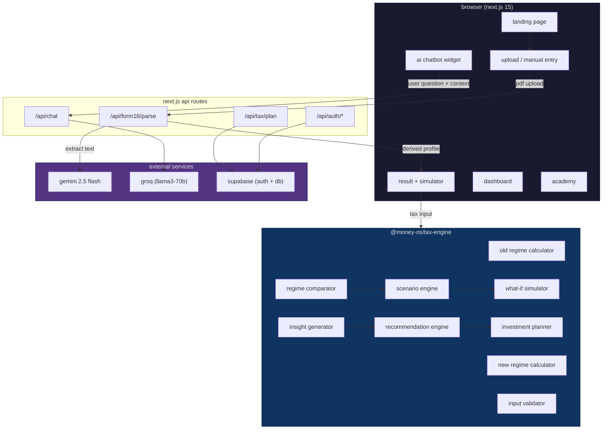

# money os

> a financial planning engine for salaried indians who are tired of overpaying taxes and overpaying ca's.

---

## the problem

so umm...here's the thing. most salaried people in india — and i mean like, a LOT of them — pay more tax than they legally have to. not because they're doing something wrong, but because nobody ever showed them what to claim, which regime actually saves more, and when to act on it.

and hmm...what do people do today? they either pay a ca ₹5,000–₹15,000 every year just to file a return (and the ca barely explains anything), or they use tools that throw numbers at them without context. or worse — they just... do nothing. pick new regime because hr said so, skip 80c because it felt confusing, and lose ₹30,000–₹80,000 a year. every year. silently.

think about it — **groww simplified stock investing for millions of people.** before groww, you needed a demat account, a broker, phone calls, physical forms. groww said "nah, let's just make it easy." and suddenly everyone could buy mutual funds from their phone.

**i wanted money os to be that — but for taxes and financial planning.** eliminate the middle layer. make it so simple that a first-time earner who doesn't know what 80c means can upload one pdf and walk away with a full year's plan.

---

## the solution

money os is a full-stack financial simulation engine. you give it your salary details — either by uploading your form 16 pdf or entering them manually — and it does everything a ca would do, but instantly, transparently, and for free.

here's what it actually does right now:

### core features (what's live today)

**1. ai-powered form 16 parsing**
- upload your form 16 pdf (the thing your employer gives you every may/june)
- gemini 2.5 flash reads it, extracts every field — salary components, tds, deductions, regime, the works
- handles password-protected pdfs too
- if you don't have form 16? no worries — manual entry flow with a clean 7-step wizard

**2. dual regime tax engine**
- computes your tax under both old regime and new regime (fy 2025-26, ay 2026-27)
- covers ALL deduction sections — 80c, 80d, 80ccd(1b), 80dd, 80ddb, 80e, 80ee, 80eea, 80eeb, 80g, 80gg, 80tta, 80ttb, 80u, section 24b, hra exemption, lta, professional tax, standard deduction
- age-based slabs (below 60, senior citizen, super senior)
- surcharge brackets, section 87a rebate with marginal relief, education cess
- full audit trail — step-by-step breakdown showing exactly how your tax was calculated
- tells you which regime wins and **why**, in plain english

**3. what-if simulator**
- interactive sliders for 80c, 80d, nps, home loan interest, rent
- move a slider → instantly see how your tax changes in both regimes
- helps you discover if investing more can flip the regime recommendation
- aha moment: "oh wait, if i put ₹50k in nps, old regime becomes cheaper?"

**4. scenario engine**
- three modes: current (reality), optimized (if you max everything), custom (your what-if)
- shows the gap between what you're paying and what you could be paying
- loss meter — literally shows how much you're overpaying vs theoretical minimum

**5. insight & recommendation engine**
- auto-generates actionable insights: "you used ₹0 of ₹1.5l under 80c"
- severity-tagged: success, warning, danger, info
- each insight has a potential saving amount and a cta
- recommendations are strategy-level: "switch to old regime after investing ₹18k/month"
- computes break-even monthly investment — the exact sip amount that makes old regime worth it

**6. investment planner**
- generates a full annual allocation: what to invest, in what section, how much per month
- maps each instrument to 80c, 80d, nps, or personal goals
- 12-month cash flow plan with sip dates, lumpsum suggestions, and affordability checks
- feasibility rating: easy, moderate, or stretch

**7. ai ca chatbot**
- floating chat widget powered by groq (llama3-70b)
- context-aware — it knows your income, deductions, regime, everything
- ask it anything: "should i invest in nps?", "why is old regime better for me?", "explain section 80tta"
- fallback to llama-3.1-8b if primary model is busy

**8. money os academy (learn module)**
- searchable tax knowledge base for fy 2025-26
- four tabs: tax slabs, deductions, rebates & surcharge, basic concepts
- old vs new regime comparison tables
- every section explained without jargon — like a friend who happens to be a ca
- horizontal card layout, theme-aware (light/dark), mobile-friendly

**9. dashboard**
- portfolio overview: invested vs current value, xirr, gain/loss
- tax savings tracker with section-wise progress bars (80c, 80d, nps)
- calendar with upcoming deadlines (advance tax, itr filing, proof submission)
- active sip mandates and recent transactions
- notifications system (sip alerts, tax reminders, goal milestones)

**10. reports**
- tax comparison report
- investment plan summary
- form 12bb generator (the thing hr asks for in january)
- capital gains view
- everything exportable

**11. authentication & onboarding**
- otp-based signup (mobile + email)
- 7-step onboarding: profile → pan → kyc → face → bank → mpin → salary setup
- session management with supabase auth
- role-based access (user, admin, ops, support)

**12. premium ui/ux**
- glassmorphism everywhere — frosted glass cards, aurora backgrounds, glow effects
- gsap + framer motion animations throughout
- split text hero animations
- liquid glass buttons, spotlight cards, border glow effects
- light/dark mode with seamless transitions
- fully responsive — works on mobile, tablet, desktop

---

## tech stack

### frontend
| layer | tech |
|---|---|
| framework | next.js 15 (app router, turbopack) |
| language | typescript 5 |
| styling | tailwind css 3 |
| animations | framer motion 11 + gsap 3 |
| state management | zustand 4 (persisted to session storage) |
| forms | react-hook-form + zod validation |
| ui primitives | radix ui (accordion, dialog, tabs, slider, tooltip, etc.) |
| charts | recharts 2 |
| icons | lucide-react |
| theming | next-themes (light/dark) |
| fonts | geist (variable font) |
| pdf rendering | @react-pdf/renderer |
| pdf parsing | pdfjs-dist 5 + pdf-parse 2 |
| confetti | canvas-confetti (yes, we celebrate tax savings) |

### backend
| layer | tech |
|---|---|
| api routes | next.js route handlers (app/api/*) |
| ai parsing | gemini 2.5 flash (form 16 extraction) |
| ai chatbot | groq api → llama3-70b-8192 (primary) + llama-3.1-8b-instant (fallback) |
| auth | supabase auth (otp, session management) |
| database | supabase postgres (16 tables, rls on everything) |
| email | resend |
| sms | msg91 |
| encryption | bcryptjs (pan encryption, mobile hashing) |

### shared packages (monorepo)
| package | what it does |
|---|---|
| `@money-os/tax-engine` | pure typescript tax computation — old regime, new regime, slabs, deductions, hra, lta, surcharge, cess, rebate, scenario engine, what-if, insights, recommendations, investment planner, validation |
| `@money-os/types` | shared type definitions across frontend and backend — 30+ interfaces covering salary, employer, life situation, investments, goals, tax results, form 16, holdings, transactions |
| `@money-os/ui` | shared ui component library |

### infrastructure
| layer | tech |
|---|---|
| monorepo | turborepo 2 (with workspace dependency resolution) |
| database | supabase postgres with 16 tables, rls, triggers, pg_trgm, pgcrypto |
| deployment | docker (multi-stage build) + nginx reverse proxy |
| process management | pm2 |
| hosting | aws ec2 (t3.large recommended) |

### database schema (16 tables)

```
users, otp_sessions, audit_log, salary_profiles, life_situations,
existing_investments, financial_goals, risk_assessments, tax_calculations,
investment_plans, mf_funds, holdings, transactions, sip_mandates,
notifications, admin_users
```

every table has row-level security. tax calculations and audit logs are append-only (immutable). dpdp act 2023 compliant — consent tracking, data deletion requests, ip logging.

---

## architecture



in 3–4 sentences: money os is a turborepo monorepo with a next.js 15 frontend, a pure-typescript tax computation engine as a shared package, and next.js api routes acting as the backend layer. the tax engine is completely stateless — it takes a `TaxInput` object and returns a full `TaxComparisonResult` with audit trails, insights, and recommendations. form 16 parsing uses gemini 2.5 flash for ai extraction with a regex-based local fallback. all user data lives in supabase postgres with row-level security, and the ai chatbot runs on groq's llama3-70b with full tax-profile context injection.

---

## how to run

### prerequisites
- node.js 20+
- npm 10+

### local development

```bash
# clone the repo
git clone https://github.com/RajanChauhan-07/Money-OS.git
cd money-os

# install dependencies (monorepo — installs everything)
npm install

# create your env file
cp frontend/web/.env.local.example frontend/web/.env.local
# fill in: supabase keys, gemini api key, groq api key

# start the dev server (turbopack — blazing fast)
npm run dev

# open http://localhost:3000
```

### environment variables

```bash
# supabase
NEXT_PUBLIC_SUPABASE_URL=your_supabase_url
NEXT_PUBLIC_SUPABASE_ANON_KEY=your_anon_key
SUPABASE_SERVICE_ROLE_KEY=your_service_role_key

# ai
GEMINI_API_KEY=your_gemini_key          # form 16 parsing
GROQ_API_KEY=your_groq_key              # ai chatbot

# optional
RESEND_API_KEY=your_resend_key          # email
MSG91_API_KEY=your_msg91_key            # sms otp
ELEVEN_LABS_API_KEY=your_elevenlabs_key # voice (future)
```

### production (docker)

```bash
# build and run with docker compose
docker compose up -d --build

# the app will be live on port 80 (nginx → next.js on 3000)
```

### production (manual on ec2)

```bash
# on your ec2 instance (ubuntu 22.04, t3.large recommended)
sudo apt update && sudo apt install -y docker.io docker-compose

# sync the codebase
scp -r ./money-os ubuntu@YOUR_IP:/home/ubuntu/

# build and launch
cd /home/ubuntu/money-os
docker compose up -d --build

# verify
curl http://YOUR_IP  # should return 200
```

---

## project structure

```
money-os/
├── frontend/
│   └── web/                    # next.js 15 app
│       ├── app/
│       │   ├── page.tsx        # landing page
│       │   ├── upload/         # form 16 upload
│       │   ├── setup/          # manual entry wizard
│       │   ├── review/         # review extracted data
│       │   ├── result/         # tax comparison result
│       │   ├── simulator/      # what-if simulator
│       │   ├── learn/          # academy module
│       │   ├── api/
│       │   │   ├── form16/     # ai-powered pdf parsing
│       │   │   ├── chat/       # groq chatbot
│       │   │   ├── tax/        # save/load plans
│       │   │   ├── auth/       # otp signup/login
│       │   │   ├── funds/      # mutual fund data
│       │   │   ├── portfolio/  # holdings & transactions
│       │   │   └── reports/    # report generation
│       │   └── (auth)/         # auth pages (login, signup, otp)
│       ├── components/
│       │   ├── ui/             # 25+ reusable components
│       │   ├── screens/        # full-page screen compositions
│       │   └── layout/         # nav, sidebar, footer
│       └── lib/
│           ├── stores/         # zustand state management
│           ├── supabase/       # db client helpers
│           └── utils/          # formatters, crypto, helpers
├── backend/
│   ├── tax-engine/             # pure ts tax computation
│   │   └── src/
│   │       ├── old-regime.ts   # 24kb — full old regime calculator
│   │       ├── new-regime.ts   # new regime calculator
│   │       ├── compare.ts      # regime comparator + scenario engine
│   │       ├── slabs.ts        # all fy 2025-26 tax rules externalized
│   │       ├── insights.ts     # auto-generated tax insights
│   │       ├── recommendations.ts  # strategy recommendations
│   │       ├── planner.ts      # investment allocation planner
│   │       ├── validation.ts   # input validation
│   │       └── utils.ts        # slab computation, surcharge, rebate
│   └── types/                  # 30+ shared typescript interfaces
├── database/
│   └── supabase/
│       ├── combined_migration.sql  # 16 tables, rls, triggers
│       └── functions/              # edge functions
├── Dockerfile.web              # multi-stage production build
├── docker-compose.yml          # app + nginx orchestration
├── nginx.conf                  # reverse proxy config
├── turbo.json                  # turborepo pipeline config
└── package.json                # workspace root
```

---

## the tax engine — how it actually works

this is the brain of money os. it's a pure typescript library with zero dependencies — no database calls, no api calls, no side effects. you give it a `TaxInput`, it gives you back everything.

```
TaxInput → computeOldRegime() → RegimeResult (old)
TaxInput → computeNewRegime() → RegimeResult (new)
Both results → compareTaxRegimes() → TaxComparisonResult
TaxInput → runScenarioEngine() → ScenarioEngineResult (current + optimized)
TaxInput + WhatIfState → runWhatIfScenario() → TaxComparisonResult (custom)
TaxInput → generateInsights() → Insight[]
TaxInput + Result → generateRecommendations() → Recommendation[]
TaxInput + Result → generateInvestmentPlan() → InvestmentPlan
```

### what the engine computes:

- **hra exemption** — min of (actual hra, rent - 10% basic, 50%/40% basic for metro/non-metro)
- **lta exemption** — based on actual claims
- **section 80c** — epf + ppf + elss + nsc + lic + tuition + ssy + tax-saving fd + scss (capped at ₹1.5l)
- **section 80d** — self + family + parents, senior citizen aware (₹25k/₹50k limits)
- **section 80ccd(1b)** — additional nps (₹50k above 80c)
- **section 80ccd(2)** — employer nps (up to 14% of basic)
- **section 24b** — home loan interest (₹2l cap for self-occupied, no cap for let-out)
- **section 80dd/80ddb** — disability and medical treatment
- **section 80e** — education loan interest (no upper limit)
- **section 80ee/80eea/80eeb** — housing and ev loan interest
- **section 80g** — donations (100% and 50% eligible)
- **section 80gg** — rent without hra
- **section 80tta/80ttb** — savings/deposit interest
- **section 80u** — self disability
- **professional tax** — up to ₹2,400/year
- **standard deduction** — ₹50k (old) / ₹75k (new)
- **surcharge** — tiered brackets with regime-specific caps
- **section 87a rebate** — with marginal relief computation
- **education cess** — 4% on tax + surcharge

---

## what's next — if i had another month

okay so umm...here's what i'd build next. honestly there's so much i want to do.

**voice assistant — a ca that speaks your language.** i'd integrate elevenlabs for text-to-speech. imagine uploading your form 16 and instead of reading numbers on a screen, a voice walks you through it: "hey, so your employer put you in new regime but hmm...looking at your hra and home loan, old regime would actually save you ₹34,000. let me explain why." that's the experience i want. a ca who talks to you. in hindi, tamil, telugu, marathi, bengali — whatever you're comfortable with. because tax literacy in india is terrible and most people aren't comfortable reading english financial documents.

**vernacular ai bot.** building on the voice thing — a full conversational ai that explains taxes in regional languages. not just translation, but actual explanation in the way a local ca would talk to you. "arre bhai, dekho 80c mein aapne sirf 72 hazaar lagaye hain epf se. abhi bhi 78 hazaar ka room hai. elss daal do, tax bachega." that kind of thing. a ca who is comfortable in every language, who walks through the journey from start to end.

**google auth + social login.** right now we have otp-based auth which works, but google sign-in would make onboarding instant. one tap and you're in. no otp, no waiting. just start planning.

**mf aggregator integrations.** connecting to actual mutual fund aggregators (like mfcentral, cams, kfintech) so your real portfolio data auto-populates. right now we have mock data for the portfolio view — with real integrations, the dashboard would show your actual holdings, actual xirr, actual gains. and then the recommendation engine becomes insanely powerful because it knows what you already own.

**mobile app.** this is huge. a large portion of the audience is on mobile — like 85% of india's internet users. i'd build a react native app (or maybe expo) with the same tax engine running locally. offline-first, biometric auth, push notifications for sip dates and deadlines. the web app is great for detailed planning, but the mobile app would be the daily driver.

**academy v2 — like varsity for taxes.** you know how zerodha built varsity? it's become THE resource for learning about markets in india. i want money os academy to be that for taxes and personal finance. deep, structured courses — not blog posts. "understanding your payslip", "hra vs 80gg: which one applies to you?", "how to read your form 26as", "when does old regime make sense?". with quizzes, progress tracking, and certificates maybe. because tax and financial literacy in india is genuinely low and most people aren't even aware of what they don't know.

**monetization.** i'd explore subscriptions — maybe a premium tier for advanced features like multi-year planning, capital gains optimization, family tax planning (spouse + parents), and priority ai support. maybe a ₹99/month or ₹499/year plan. i'd brainstorm more honestly, talk to users, understand what they'd actually pay for. the core planning tool stays free forever though — that's non-negotiable.

**security hardening.** implementing csp headers, rate limiting on all api routes, audit log encryption, and automated pen testing. also api key rotation, secret scanning in ci/cd, and proper cors configuration for production. the dpdp act compliance is already built into the database schema but i'd add data export (right to portability) and automated deletion workflows.

**itr filing integration.** the dream endgame — after you plan your taxes, one click to actually file your itr. partner with tax filing services or build a direct integration with the income tax portal. that closes the entire loop.

---

## the user journey


---

## screenshots

> *coming soon — recording the demo walkthrough right now*

---

## why this approach

the technical bet is simple: **tax computation belongs on the client, not behind an api.** the entire tax engine is a pure typescript library with zero side effects. it runs in the browser. no network latency, no server load, no rate limits. you move a slider in the what-if simulator and the result updates in under 5ms. that's the experience — instant, transparent, local.

---

## credits

built by [rajan chauhan](https://github.com/RajanChauhan-07) — a salaried engineer who got tired of not understanding his own taxes.

---

*money os does not file itr, execute investments, or manage money. it is a planning and education tool. for formal tax advice, please consult a qualified chartered accountant.*
